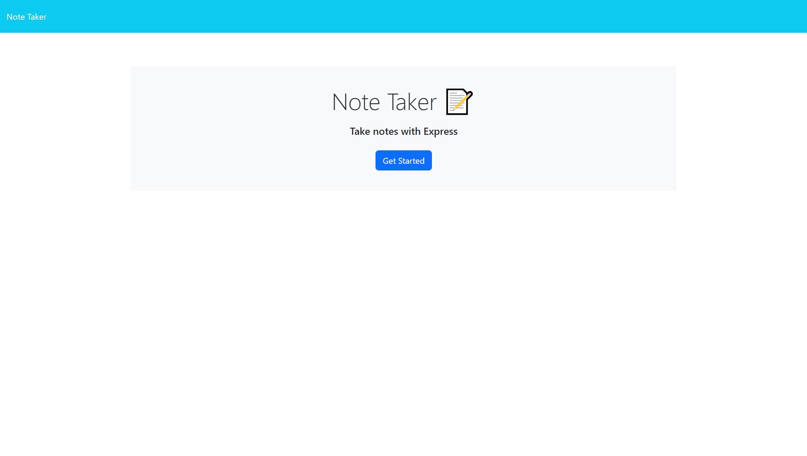
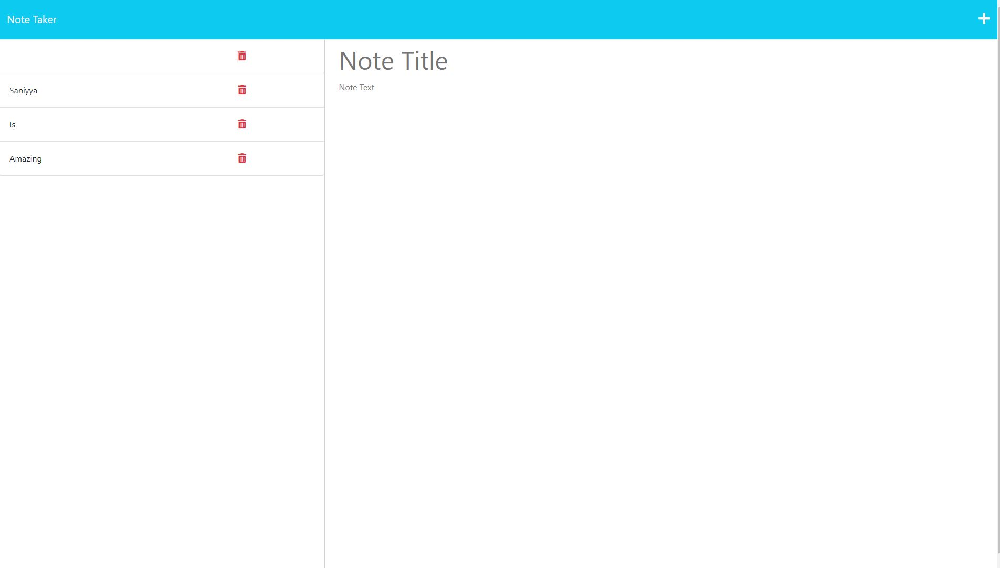

# 11 Express.js: Note Taker

## License

## Description

Modified starter code to create an application called Note Taker that can be used to write and save notes. This application uses an Express.js back end and saves and retrieves note data from a JSON file.

## User Story

AS A small business owner
I WANT to be able to write and save notes
SO THAT I can organize my thoughts and keep track of tasks I need to complete

## Live URL
[Visit Website](https://cryptic-fortress-67689.herokuapp.com/)

## Questions 
[Email me](mailto:saniyya.mcclendon@gmail.com)